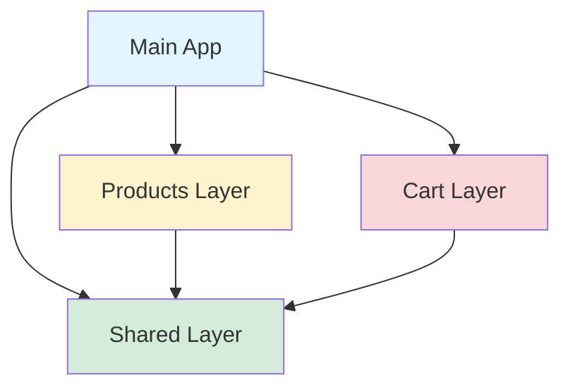
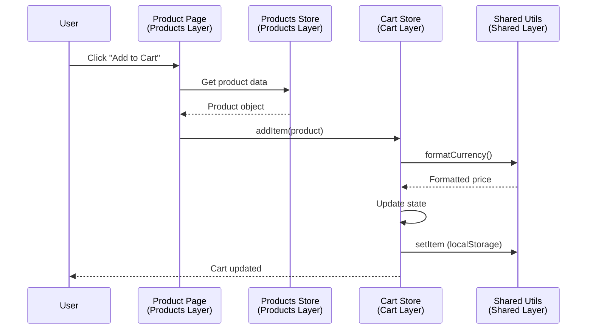
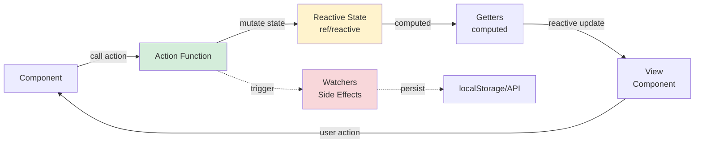
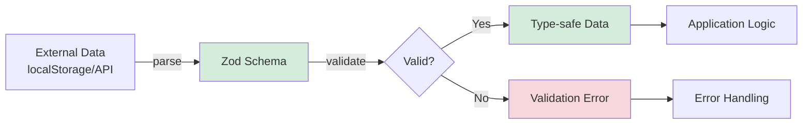
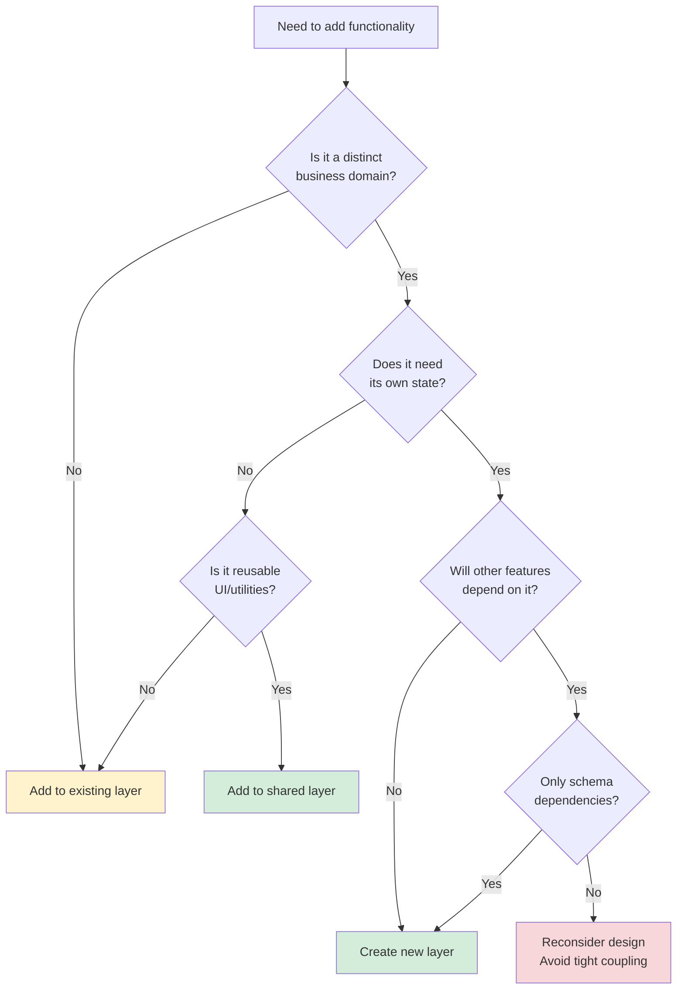

# Architecture Documentation: Nuxt Layer-Based Design

## Table of Contents

- [Overview](#overview)
- [Layer-Based vs Feature-Based Architecture](#layer-based-vs-feature-based-architecture)
- [Core Principles](#core-principles)
- [Layer Structure](#layer-structure)
- [Layer Communication Patterns](#layer-communication-patterns)
- [Store Architecture (Pinia Composition API)](#store-architecture-pinia-composition-api)
- [Schema-Driven Development](#schema-driven-development)
- [Layer Configuration](#layer-configuration)
- [Linting & Architecture Enforcement](#linting--architecture-enforcement)
- [When to Create a New Layer](#when-to-create-a-new-layer)
- [Example: Adding New Layer](#example-adding-new-layer)
- [Layer Dependency Graph](#layer-dependency-graph)
- [Testing Layers](#testing-layers)
- [Migration Guide](#migration-guide)
- [Common Pitfalls](#common-pitfalls)
- [Best Practices Checklist](#best-practices-checklist)
- [Resources](#resources)

## Overview

This Nuxt 4 app uses **layer-based architecture** to organize code by business features. Each layer is self-contained with its own components, stores, schemas, and utilities. Layers provide natural boundaries for separation of concerns.

## Layer-Based vs Feature-Based Architecture

### Conceptual Equivalence

Nuxt **layers** are conceptually identical to **features** in traditional feature-based architectures:

| Traditional Feature-Based | Nuxt Layer-Based | Purpose |
|---------------------------|------------------|---------|
| `src/features/products/` | `layers/products/` | Product catalog feature |
| `src/features/cart/` | `layers/cart/` | Shopping cart feature |
| `src/shared/` | `layers/shared/` | Shared utilities & UI |

Both approaches share the same **core principles**:
- ✅ **Feature isolation** - Code organized by business domain
- ✅ **Unidirectional dependency flow** - One-way imports
- ✅ **Explicit imports** - No auto-imports, clarity over magic
- ✅ **Colocation** - Related code lives together

### Key Differences

#### 1. Folder Organization

**Traditional:**
```
src/features/products/
├── api/
├── components/
├── hooks/
├── stores/
├── types/
└── utils/
```

**Nuxt Layers:**
```
layers/products/
├── nuxt.config.ts    # Layer metadata
└── app/
    ├── components/
    ├── pages/         # Route pages
    ├── schemas/       # Zod schemas (runtime validation)
    ├── stores/
    └── utils/
```

**Differences:**
- Nuxt adds `app/` nesting (framework convention)
- Each layer has its own `nuxt.config.ts`
- API routes in root `server/` directory (not per-layer)
- Uses Zod `schemas/` instead of TypeScript `types/`
- Includes `pages/` for routes (file-based routing)

#### 2. Boundary Enforcement

**Traditional (ESLint-based):**
```javascript
// Prevented by ESLint rules (lint-time)
'import/no-restricted-paths': ['error', {
  zones: [
    {
      target: './src/features/products',
      from: './src/features/cart'
    }
  ]
}]
```
- ⚠️ Enforced at **lint-time**
- Can be bypassed (caught in CI/pre-commit)
- Helpful error messages

**Nuxt Layers (Natural + ESLint):**
```typescript
// Prevented by Nuxt layer system (compile-time)
import { useProductsStore } from '#layers/products/...'
// ❌ Error: Cannot find module (TypeScript)
```
- ✅ **Compile-time** enforcement (primary)
- ✅ **Lint-time** enforcement (secondary, via ESLint)
- **Defense in depth** - caught at multiple stages
- Build fails immediately if violated

#### 3. Import Paths

**Traditional:**
```typescript
// Feature imports
import { Product } from '@/features/products/types/product'
import { formatCurrency } from '@/shared/utils/currency'
```

**Nuxt Layers:**
```typescript
// Layer imports
import type { Product } from '#layers/products/app/schemas/product'
import { formatCurrency } from '#layers/shared/app/utils/currency'
```

- `#layers/` prefix instead of `@/features/`
- Includes `app/` in path
- Same verbosity, similar patterns

#### 4. Runtime Validation

**Traditional (TypeScript-only):**
```typescript
// types/product.ts
export interface Product {
  id: string
  name: string
  price: number
}
// ⚠️ Compile-time only, no runtime validation
```

**Nuxt Layers (Zod-first):**
```typescript
// schemas/product.ts
export const ProductSchema = z.object({
  id: z.string().min(1),
  name: z.string().min(1),
  price: z.number().positive(),
})
export type Product = z.infer<typeof ProductSchema>
// ✅ Compile-time + runtime validation
```

### Advantages of Nuxt Layer Approach

1. **Stronger Enforcement** - Compile-time + lint-time boundaries
2. **Runtime Safety** - Zod validation at all boundaries
3. **Modularity** - Layers can be published as npm packages
4. **Framework Integration** - Native Nuxt feature (file-based routing, etc.)
5. **Distributed Config** - Each layer is self-contained

### When to Use Each

**Use Traditional Feature-Based When:**
- Not using Nuxt/meta-framework
- Framework doesn't support layers
- Want flatter directory structure

**Use Nuxt Layer-Based When:**
- Using Nuxt 3/4
- Want stronger boundary enforcement
- Need publishable/reusable modules
- Prefer runtime validation (Zod)

### Summary

Nuxt layers **are** features - just with:
- Framework-specific conventions (`app/`, `#layers/`)
- Stronger enforcement mechanisms
- Better modularity and reusability
- Built-in runtime validation patterns

The **architectural principles remain identical**: feature isolation, unidirectional flow, and explicit dependencies.

## Core Principles

### 1. Feature Isolation
Each layer represents a distinct business domain:
- **shared**: Reusable UI components and utilities (no business logic)
- **products**: Product catalog, filtering, and display
- **cart**: Shopping cart with persistence and calculations

### 2. Dependency Flow (Unidirectional)



**Rules:**
- Feature layers (products, cart) can **only** depend on `shared` layer
- Feature layers **cannot** import from each other - strict independence
- All shared domain entities (Product, ProductCategory) live in `shared` layer
- Main app can import from any layer
- No circular dependencies allowed

### 3. Explicit Imports Only
Auto-imports are **disabled** for code clarity:
- All Vue/Nuxt composables must be explicitly imported
- All components must be manually imported
- Better IDE support and refactoring safety

## Layer Structure

### Physical Directory Layout

```
app/                 # Main application layer
├── pages/
│   ├── index.vue              # Home page (composes products + cart)
│   └── products/
│       └── [id].vue           # Product detail page
│
layers/
├── shared/          # Foundation layer (domain entities + utilities)
│   ├── nuxt.config.ts
│   └── app/
│       ├── components/
│       │   └── baseBadge.vue
│       ├── schemas/
│       │   └── product.ts     # Product & ProductCategory (domain contracts)
│       ├── test/
│       │   └── mocks.ts       # Mock generators for Product
│       └── utils/
│           ├── currency.ts
│           └── storage.ts
│
├── products/        # Product catalog feature (filtering, sorting, display)
│   ├── nuxt.config.ts
│   └── app/
│       ├── components/
│       │   ├── productCard.vue
│       │   ├── productFilters.vue
│       │   ├── productGrid.vue
│       │   ├── productDetailImage.vue
│       │   └── productDetailInfo.vue
│       ├── schemas/
│       │   └── filters.ts     # ProductFilter & ProductSort
│       ├── stores/
│       │   └── products/
│       │       ├── products.ts        # Pinia integration
│       │       ├── productsModel.ts   # State type definitions
│       │       ├── productsUpdate.ts  # Pure reducers
│       │       └── productsEffects.ts # Side effects (API calls)
│       ├── test/
│       │   └── mocks.ts       # Mock generators for filters
│       └── utils/
│           └── filters.ts
│
└── cart/            # Shopping cart feature (add/remove, persistence)
    ├── nuxt.config.ts
    └── app/
        ├── components/
        │   ├── cartItem.vue
        │   ├── cartList.vue
        │   └── cartSummary.vue
        ├── pages/
        │   └── shoppingCart.vue
        ├── schemas/
        │   └── cart.ts        # CartItem (references Product from shared)
        ├── stores/
        │   └── cart/
        │       ├── cart.ts           # Pinia integration
        │       ├── cartModel.ts      # State type definitions
        │       ├── cartUpdate.ts     # Pure reducers
        │       └── cartEffects.ts    # Side effects (localStorage)
        ├── test/
        │   └── mocks.ts       # Mock generators for cart items
        └── utils/
            └── calculations.ts
```

### Layer Architecture Diagram

```mermaid
graph TB
    subgraph "Layer Hierarchy (Bottom → Top)"
        direction TB
        L1[Shared Layer<br/>UI components, utilities]
        L2[Products Layer<br/>Catalog management]
        L3[Cart Layer<br/>Shopping cart]
        L4[Main App<br/>Pages, global config]
    end

    L4 -.imports.-> L3
    L4 -.imports.-> L2
    L4 -.imports.-> L1
    L3 -.imports.-> L1
    L2 -.imports.-> L1
    L3 -.schemas only.-> L2

    style L1 fill:#d4edda
    style L2 fill:#fff3cd
    style L3 fill:#f8d7da
    style L4 fill:#e1f5ff
```



## Layer Communication Patterns

### Import Paths

Nuxt provides special aliases for layer imports:

```typescript
// ✅ Importing from shared layer (domain entities + utilities)
import { formatCurrency } from '#layers/shared/app/utils/currency'
import BaseBadge from '#layers/shared/app/components/baseBadge.vue'
import type { Product } from '#layers/shared/app/schemas/product'

// ✅ Importing feature-specific schemas
import { ProductFilterSchema } from '#layers/products/app/schemas/filters'

// ✅ Importing from same layer
import { filterProducts } from '../../utils/filters'

// ❌ WRONG: Importing business logic across feature layers
import { useProductsStore } from '#layers/products/app/stores/products/products'
```

### Data Flow Diagram



## Store Architecture (Pinia Composition API)

Each layer's store follows **Pinia Composition API** pattern for idiomatic Vue state management:



### Store File Structure

Each store is a **single file** using Pinia's composition API:

**`use{Feature}Store.ts`** - Complete store definition

**Example: Cart Store**

```typescript
// stores/cart/useCartStore.ts
import { defineStore } from 'pinia'
import { ref, computed, watch } from 'vue'
import type { CartItem } from '../../schemas/cart'
import type { Product } from '#layers/shared/app/schemas/product'

export const useCartStore = defineStore('cart', () => {
  // State (reactive)
  const items = ref<CartItem[]>([])

  // Getters (computed)
  const itemCount = computed(() => items.value.length)
  const isEmpty = computed(() => items.value.length === 0)

  // Actions (functions - can mutate state directly)
  function addItem(product: Product) {
    const existing = items.value.find(i => i.product.id === product.id)
    if (existing) {
      existing.quantity += 1
    } else {
      items.value.push({ product, quantity: 1 })
    }
  }

  function removeItem(productId: string) {
    items.value = items.value.filter(i => i.product.id !== productId)
  }

  // Side effects (watchers, initialization)
  loadFromStorage()
  watch(items, (newItems) => {
    saveToStorage(newItems)
  }, { deep: true })

  // Public API
  return {
    // State
    items,
    // Getters
    itemCount,
    isEmpty,
    // Actions
    addItem,
    removeItem,
  }
})
```

**Benefits:**
- ✅ Standard Pinia pattern (familiar to Vue developers)
- ✅ Less boilerplate (1 file vs 4 files)
- ✅ Direct state mutation in actions (Vue-like)
- ✅ Computed properties for derived state
- ✅ TypeScript inference from function signatures
- ✅ Easy to test actions and getters

## Schema-Driven Development

### Validation with Zod

All data contracts use **Zod schemas** for runtime validation:



**Schema Locations:**
- `layers/shared/app/schemas/` - **Product, ProductCategory** (domain entities used by multiple layers)
- `layers/products/app/schemas/` - ProductFilter, ProductSort (feature-specific)
- `layers/cart/app/schemas/` - CartItem (references Product from shared)

**Usage:**
```typescript
// Define schema
export const ProductSchema = z.object({
  id: z.string().min(1),
  name: z.string().min(1).max(200),
  price: z.number().int().positive(),
})

export type Product = z.infer<typeof ProductSchema>

// Validate data
const result = ProductSchema.safeParse(externalData)
if (result.success) {
  // TypeScript knows this is valid Product
  const product = result.data
}
```

**Schema Architecture:**
- **Shared schemas** = Domain entities needed by multiple layers (Product, ProductCategory)
- **Feature schemas** = Layer-specific types (ProductFilter, CartItem)
- Feature layers **only** import from shared layer - never from each other

## Layer Configuration

Each layer has `nuxt.config.ts`:

```typescript
export default defineNuxtConfig({
  $meta: {
    name: 'products',
    description: 'Products feature with catalog, filtering, and sorting',
  },

  components: {
    dirs: [], // Auto-imports disabled
  },

  imports: {
    autoImport: false, // Explicit imports only
  },
})
```

Layers are auto-registered by Nuxt from `layers/` directory.

## Linting & Architecture Enforcement

### Dual-Linting Setup

```mermaid
graph LR
    A[Source Code] --> B[Oxlint<br/>Fast checks]
    B --> C{Pass?}
    C -->|Yes| D[ESLint<br/>Custom rules]
    C -->|No| E[Fix errors]
    D --> F{Pass?}
    F -->|Yes| G[✅ Code OK]
    F -->|No| E

    style B fill:#d4edda
    style D fill:#fff3cd
    style G fill:#d4edda
    style E fill:#f8d7da
```



**Oxlint (Primary - Speed):**
- `.oxlintrc.json` - Single source of truth
- 50-100x faster than ESLint
- Correctness, suspicious patterns, style checks
- Type-aware linting (experimental)

**ESLint (Secondary - Custom Rules):**
- `eslint.config.mjs` - Vue component rules, complexity checks
- `vue/no-undef-components` - Critical (catches missing imports)
- `eslint-plugin-nuxt-layers` - Architecture boundary enforcement (defense in depth)

### Layer Boundaries (Defense in Depth)

This project uses **two layers of boundary enforcement**:

#### 1. Compile-time (Primary - Nuxt Layers)
```typescript
// ❌ This won't work - TypeScript cannot resolve cross-layer imports
import { useProductsStore } from '#layers/products/...'
// Error: Cannot find module (Nuxt layer isolation)

// ✅ Only shared layer is accessible
import { formatCurrency } from '#layers/shared/...'
```

**Nuxt layers naturally prevent** cross-layer imports at **compile-time**. Build fails immediately.

#### 2. Lint-time (Secondary - ESLint Plugin)

ESLint provides early feedback using the [`eslint-plugin-nuxt-layers`](https://www.npmjs.com/package/eslint-plugin-nuxt-layers) package (eslint.config.mjs:158-177):

**Plugin Configuration:**
```typescript
{
  plugins: { 'nuxt-layers': nuxtLayers },
  rules: {
    'nuxt-layers/layer-boundaries': ['error', {
      root: 'layers',
      aliases: ['#layers'],
      layers: {
        shared: [],
        products: ['shared'],
        cart: ['shared'],
        app: ['*'],
      },
    }],
  },
}
```

**Prevented:**
- Products layer cannot import from cart layer
- Cart layer cannot import from products layer
- Feature layers cannot import from app layer
- Shared layer cannot import from any feature layer

**Allowed:**
- Any feature layer can import from shared layer
- App layer can import from any layer
- Shared layer contains domain entities (Product) used by multiple layers

**Unidirectional Flow:**
```
shared ← products ← cart ← app
```

**Why Both?**
- **Compile-time**: Strongest enforcement, prevents broken builds
- **Lint-time**: Faster feedback in editor/on save, better DX via npm package
- **Together**: Defense in depth with clear error messages at multiple stages

## When to Create a New Layer

### Decision Tree



### Create New Layer When:

✅ **Distinct Business Domain**
- Feature has its own data models, business rules
- Example: User authentication, payment processing, notifications

✅ **Independent State Management**
- Needs its own Pinia store
- State not shared with other features
- Example: Wishlist, order history, reviews

✅ **Has Own Pages/Routes**
- Feature includes dedicated pages
- Example: User profile (`/profile`), checkout flow (`/checkout`)

✅ **Clear Boundaries**
- Can define public API (components, composables)
- Minimal coupling to other layers
- Example: Analytics layer, comments system

### Add to Existing Layer When:

⚠️ **Extends Current Domain**
- Adds functionality to existing feature
- Example: Add sorting to products → products layer

⚠️ **Shares State**
- Needs access to existing store
- Example: Product reviews might extend products layer

### Add to Shared Layer When:

💡 **Pure UI Components**
- No business logic
- Reusable across features
- Example: Button, Badge, Modal

💡 **Utility Functions**
- Generic helpers (formatting, validation)
- No feature-specific logic
- Example: Date formatting, array helpers

### Anti-Patterns (Don't Create Layer For):

❌ **Single Component**
- Too granular, adds complexity
- Put in appropriate feature layer

❌ **Tightly Coupled Features**
- If two layers need to call each other's stores
- Consider merging or restructuring

❌ **Shared Business Logic**
- If multiple layers need same logic
- Move to shared utilities or rethink domain boundaries

## Example: Adding New Layer

**Scenario:** Add user authentication

### 1. Create Layer Structure

```bash
mkdir -p layers/auth/app/{components,composables,pages,schemas,stores/auth,utils}
```

### 2. Add Layer Config

```typescript
// layers/auth/nuxt.config.ts
export default defineNuxtConfig({
  $meta: {
    name: 'auth',
    description: 'User authentication and authorization',
  },

  components: { dirs: [] },
  imports: { autoImport: false },
})
```

### 3. Define Schema

```typescript
// layers/auth/app/schemas/user.ts
import { z } from 'zod'

export const UserSchema = z.object({
  id: z.string().min(1),
  email: z.string().email(),
  name: z.string().min(1),
  role: z.enum(['user', 'admin']),
})

export type User = z.infer<typeof UserSchema>
```

### 4. Create Store (Pinia Composition API)

```typescript
// layers/auth/app/stores/auth/useAuthStore.ts
import { defineStore } from 'pinia'
import { ref, computed } from 'vue'
import { UserSchema, type User } from '../../schemas/user'

export const useAuthStore = defineStore('auth', () => {
  // State
  const user = ref<User | null>(null)
  const loading = ref(false)
  const error = ref<string | null>(null)

  // Getters
  const isAuthenticated = computed(() => user.value !== null)

  // Actions
  async function login(email: string, password: string) {
    loading.value = true
    error.value = null

    try {
      const response = await $fetch('/api/auth/login', {
        method: 'POST',
        body: { email, password },
      })

      // Validate with Zod
      const validated = UserSchema.parse(response)
      user.value = validated
    } catch (err) {
      error.value = err instanceof Error ? err.message : 'Login failed'
      throw err
    } finally {
      loading.value = false
    }
  }

  function logout() {
    user.value = null
    error.value = null
  }

  // Public API
  return {
    // State
    user,
    loading,
    error,
    // Getters
    isAuthenticated,
    // Actions
    login,
    logout,
  }
})
```

### 5. Add Components

```vue
<!-- layers/auth/app/components/loginForm.vue -->
<script setup lang="ts">
import { ref } from 'vue'
import { UCard, UButton, UInput } from '#components'
import { useAuthStore } from '../stores/auth/auth'

const authStore = useAuthStore()
const email = ref('')
const password = ref('')

async function handleSubmit() {
  await authStore.login(email.value, password.value)
}
</script>

<template>
  <UCard>
    <form @submit.prevent="handleSubmit">
      <UInput v-model="email" type="email" placeholder="Email" />
      <UInput v-model="password" type="password" placeholder="Password" />
      <UButton type="submit" :loading="authStore.state.isAuthenticated">
        Login
      </UButton>
    </form>
  </UCard>
</template>
```

### 6. Add Pages

```vue
<!-- layers/auth/app/pages/login.vue -->
<script setup lang="ts">
import LoginForm from '../components/loginForm.vue'
</script>

<template>
  <div class="min-h-screen flex items-center justify-center">
    <LoginForm />
  </div>
</template>
```

### 7. Use in Other Layers

```vue
<!-- layers/cart/app/pages/checkout.vue -->
<script setup lang="ts">
import { useAuthStore } from '#layers/auth/app/stores/auth/auth'
import { useRouter } from 'vue-router'
import { computed } from 'vue'

const authStore = useAuthStore()
const router = useRouter()

// Protect route
const isAuthenticated = computed(() => authStore.state.isAuthenticated)

if (!isAuthenticated.value) {
  router.push('/login')
}
</script>
```

## Layer Dependency Graph

```mermaid
graph TD
    subgraph "Current Layers"
        SHARED[Shared Layer<br/>✓ Components: baseBadge<br/>✓ Utils: currency, storage]
        PRODUCTS[Products Layer<br/>✓ Store: products<br/>✓ Pages: home, product detail<br/>✓ Schemas: Product, Filters]
        CART[Cart Layer<br/>✓ Store: cart<br/>✓ Pages: shopping cart<br/>✓ Schemas: CartItem]
    end

    subgraph "Future Layers (Examples)"
        AUTH[Auth Layer<br/>○ Store: auth<br/>○ Pages: login, register<br/>○ Schemas: User]
        ORDERS[Orders Layer<br/>○ Store: orders<br/>○ Pages: order history<br/>○ Schemas: Order]
        REVIEWS[Reviews Layer<br/>○ Store: reviews<br/>○ Components: reviewList<br/>○ Schemas: Review]
    end

    PRODUCTS --> SHARED
    CART --> SHARED
    CART -.schemas.-> PRODUCTS

    AUTH --> SHARED
    ORDERS --> SHARED
    ORDERS -.schemas.-> AUTH
    ORDERS -.schemas.-> PRODUCTS
    REVIEWS --> SHARED
    REVIEWS -.schemas.-> PRODUCTS
    REVIEWS -.schemas.-> AUTH

    style SHARED fill:#d4edda
    style PRODUCTS fill:#fff3cd
    style CART fill:#f8d7da
    style AUTH fill:#e1f5ff,stroke-dasharray: 5 5
    style ORDERS fill:#e1f5ff,stroke-dasharray: 5 5
    style REVIEWS fill:#e1f5ff,stroke-dasharray: 5 5
```



## Testing Layers

### Unit Testing Stores

Pure `update` functions are easily testable:

```typescript
// layers/cart/app/stores/cart/__tests__/cartUpdate.test.ts
import { describe, it, expect } from 'vitest'
import { update } from '../cartUpdate'
import { initialModel } from '../cartModel'

describe('Cart Update', () => {
  it('adds item to cart', () => {
    const msg = {
      type: 'ADD_ITEM' as const,
      product: mockProduct,
      quantity: 1
    }

    const newModel = update(initialModel, msg)

    expect(newModel.items).toHaveLength(1)
    expect(newModel.items[0].product.id).toBe(mockProduct.id)
  })
})
```

### Integration Testing Components

```typescript
// layers/products/app/components/__tests__/productCard.test.ts
import { mount } from '@vue/test-utils'
import ProductCard from '../productCard.vue'

describe('ProductCard', () => {
  it('displays product info', () => {
    const wrapper = mount(ProductCard, {
      props: { product: mockProduct }
    })

    expect(wrapper.text()).toContain(mockProduct.name)
  })
})
```

## Migration Guide

### From Monolithic to Layers

**Before (Monolithic):**
```
app/
├── components/
│   ├── productCard.vue
│   ├── cartItem.vue
│   └── baseBadge.vue
├── stores/
│   ├── products.ts
│   └── cart.ts
└── pages/
    ├── index.vue
    └── cart.vue
```

**After (Layered):**
```
layers/
├── shared/app/components/baseBadge.vue
├── products/app/
│   ├── components/productCard.vue
│   └── stores/products/
└── cart/app/
    ├── components/cartItem.vue
    └── stores/cart/
```

**Steps:**
1. Identify business domains
2. Create layer directories
3. Move files to appropriate layers
4. Update imports to use `#layers/...` aliases
5. Extract shared code to shared layer
6. Add Zod schemas for validation
7. Refactor stores to Elm pattern (optional but recommended)

## Common Pitfalls

### 1. Over-Layering
**Problem:** Creating too many tiny layers
**Solution:** Start with broader domains, split when complexity grows

### 2. Circular Dependencies
**Problem:** Layer A imports from Layer B, which imports from Layer A
**Solution:** Extract shared code to shared layer or rethink boundaries

### 3. Leaking Implementation Details
**Problem:** Exposing internal store structure
**Solution:** Only export necessary state, getters, and actions from the store

### 4. Skipping Validation
**Problem:** Trusting external data (localStorage, API)
**Solution:** Always validate with Zod schemas at boundaries

### 5. Mixing Concerns
**Problem:** Putting business logic in shared layer
**Solution:** Shared layer = UI + utilities only, no domain logic

## Best Practices Checklist

### For Each Layer:

- [ ] Has clear business domain
- [ ] Has `nuxt.config.ts` with metadata
- [ ] Uses explicit imports (auto-imports disabled)
- [ ] Defines Zod schemas in `schemas/`
- [ ] Follows Pinia composition API pattern for stores (single file)
- [ ] Components in `components/`
- [ ] Pages in `pages/` (if needed)
- [ ] Pure utilities in `utils/`
- [ ] Only imports from shared layer (except schemas)

### For Store Files:

- [ ] `use{Feature}Store.ts` - Complete store using composition API
- [ ] State defined with `ref()` or `reactive()`
- [ ] Getters defined with `computed()`
- [ ] Actions defined as functions
- [ ] Side effects using `watch()` and initialization
- [ ] Returns all state, getters, and actions

### For Components:

- [ ] Uses `<script setup lang="ts">`
- [ ] Explicit imports for all dependencies
- [ ] Props and emits with TypeScript types
- [ ] Calls store actions directly (e.g., `store.addItem()`)

## Helpful Commands

```bash
# Lint all layers
pnpm lint

# Run development server
pnpm dev

# Type check
pnpm typecheck

# Build for production
pnpm build

# Create new layer structure
mkdir -p layers/{name}/app/{components,pages,schemas,stores/{name},utils}
touch layers/{name}/nuxt.config.ts
```

## Resources

- [Nuxt Layers Documentation](https://nuxt.com/docs/guide/going-further/layers)
- [Pinia Stores](https://pinia.vuejs.org)
- [Pinia Composition API](https://pinia.vuejs.org/core-concepts/#setup-stores)
- [Zod Validation](https://zod.dev)
- [Vue Composition API](https://vuejs.org/guide/extras/composition-api-faq.html)

## Summary

**Key Takeaways:**

1. **Layers = Business Domains**: Each layer is a feature with clear boundaries
2. **Unidirectional Flow**: shared ← products ← cart ← main app
3. **Explicit Imports**: No magic, better refactoring, clearer dependencies
4. **Pinia Composition API**: Standard Vue pattern for predictable state management
5. **Schema-Driven**: Zod validation at all boundaries
6. **Natural Enforcement**: Nuxt layers prevent cross-layer imports automatically

**When to Create New Layer:**
- Distinct business domain ✅
- Independent state ✅
- Has own pages/routes ✅
- Clear API boundaries ✅

**Add to Existing Layer:**
- Extends current feature ⚠️
- Shares state ⚠️

**Add to Shared Layer:**
- Pure UI components 💡
- Generic utilities 💡

This architecture scales from small projects to large enterprise apps while maintaining clear boundaries and testability.
